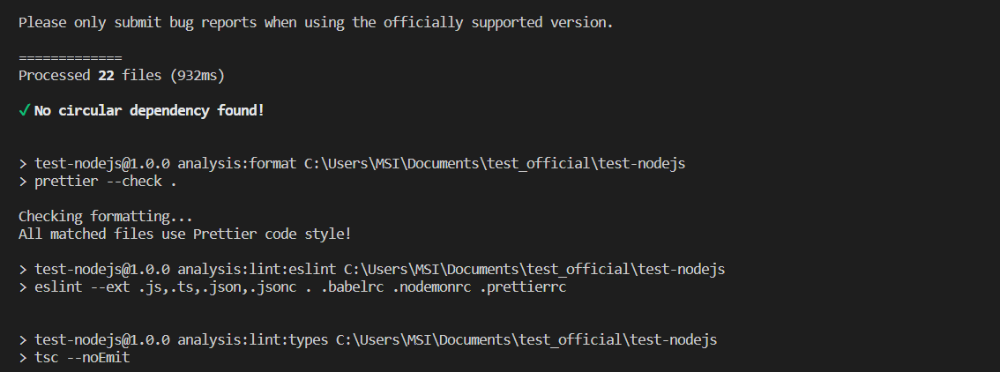
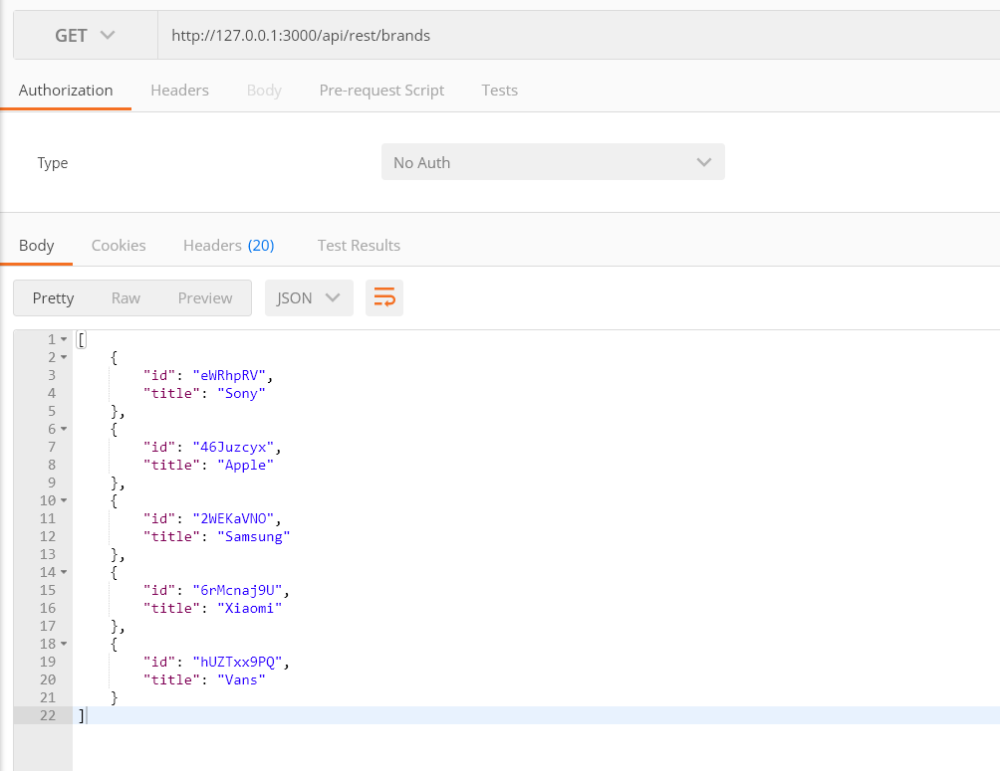
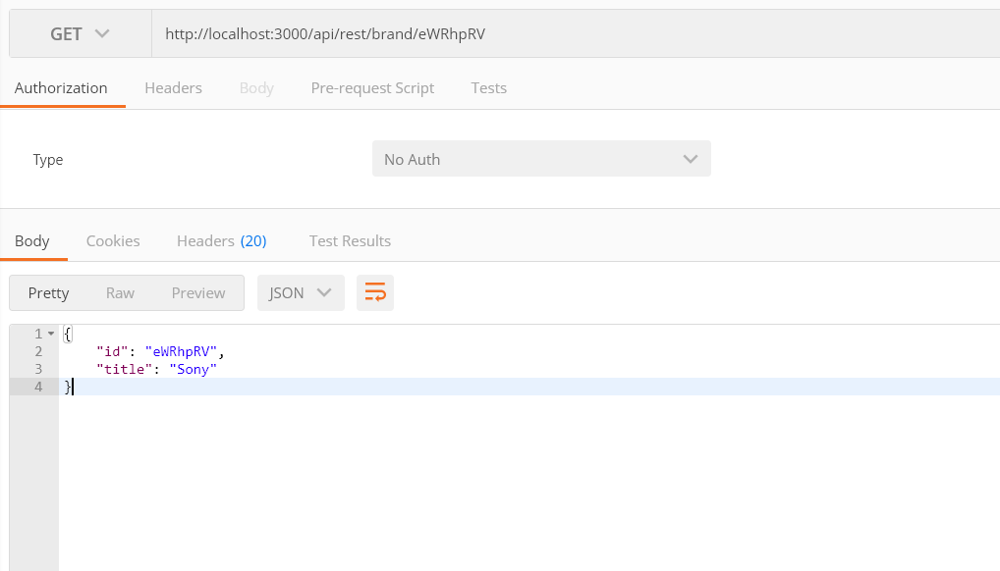
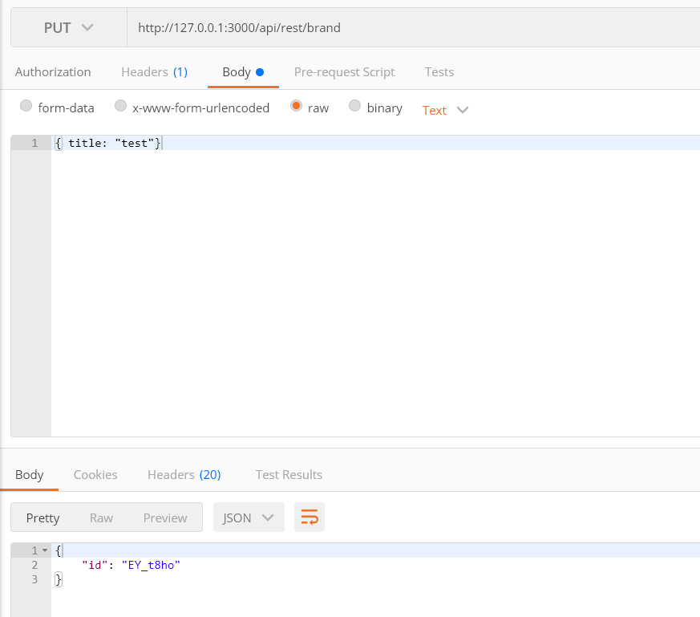

### Instruction

Projet NodeJS dont le but est de permettre une évaluation de vos capacités à développer sur cet environnement.
Une fois le projet téléchargé et installé vous aurez une heure pour effectuer deux principales tâches :

- [x] Concevoir un module, requester dont l'utilisation est faite dans le fichier `src/repository/repository.ts`. Ce module devra permettre d'effectuer des requêtes à une api rest ici fournit par le module json-server.
- [x] Corriger les erreurs détectables par les scripts d'analyse statique du code.

À l'issue du temps impartie vous me ferez une pull request depuis une branche intitulé suivant le partern suivant: `test/{votre_nom}_{votre_prenom}`.

### Installation

1. Commence par cloner le dépôt sur votre environnement local

```Shell
$ git clone git@github.com:pwdllx/test-nodejs.git
```

2. Utilise le gestionnaire de paquet ([npm](https://www.npmjs.com/)) pour installer toutes les dépendances requises

```Shell
$ cd test-nodejs && npm ci
```

### Lancement

Pour lancer le projet sur ton environnement local utilise la commande

```Shell
$ npm run dev
```

**Note**: Il te faudra créer un fichier `.env` et le renseigner en te basant sur l'exemple `.env.example`

Pour te facilité l'inspection du code pendant son exécution, tu peux te connecter au port `9229` avec tes [outils](https://nodejs.org/en/docs/guides/debugging-getting-started/#inspector-clients) habituels.
Tu peux maintenant te rendre à l'adresse http://localhost:3000/.

Voilà vous avez tous les outils et instructions nécessaires pour vous lancez 😎


____________________________________________________________________________________________________

# Création Module

D'abord, il a fallu cloner le projet et installer les différents paquets: 

```Shell
$ cd test-nodejs && npm ci
```

Avant d'entamer le projet, j'ai créé le fichier *.env* en me basant sur l'exemple que vous avez donné
```Shell
APP_HOST=127.0.0.1
APP_PORT=3000
API_URL=http://localhost:3001
NODE_ENV=development
```

Le but de ce projet était d'implémenter la classe `#requester`. Un fichier *requester.ts* a été crée dans lequel deux fonctions (**get** et **post**) ont été codé. Pour l'utilisation d'une librairie afin effectuer les reqûetes, j'ai fais le choix d'utiliser [Axios](https://axios-http.com/fr/docs/intro)


Voici les commandes utilisées pour l'installation:
```Shell
npm install @types/axios
npm install axios
```

## Qualité du code 

Ensuite, pour la qualité du code, dans le *package.json*, il y'a 4 étapes de vérification:
* les dépendances circulaires, permettant de vérifier les composants entre eux
* Prettier, permettant de mettre en place des règles d'indendation
* Eslint, permettant d'analyser la qualité du code
* Lint:types, permettant de vérifier les erreurs TypeScript

J'exécute cette commande afin de formater tous les fichiers pris en charge par Prettier 
```Shell
npx prettier --write .
```

Ensuite pour voir que toutes les vérifications fonctionnent, il faut lancer la commande:
```Shell
npm run analysis
```

Si il  n'y a aucune erreur, voici l'aperçu que vous devez avoir:




__Note__: Si jamais des messages d'erreurs apparaissent, vérifier bien que vous êtes en encodage `LF` et non `CRLF`. Lorsqu'on utilise Eslint, il est préférable d'utiliser le codage `LF`. 

Vous pouvez désormais lancer le projet:
```Shell
npm run dev
```

## TEST

Afin de réaliser les tests, j'ai utilisé POSTMAN pour effectuer les différentes requêtes.

* GET - `http://localhost:3000/api/rest/brands`:



* GET - `http://localhost:3000/api/rest/brand/eWRhpRV`:





* PUT - `http://localhost:3000/api/rest/brand`:



Documentation utilisé:
- [Axios](https://axios-http.com/fr/docs/intro)
- [POSTMAN](https://www.postman.com/)
- [Pretiier](https://prettier.io/)
- [Eslint](https://eslint.org/)

Je vous remercie de l'attention que vous porterez à mon travail et également à ma candidature.
