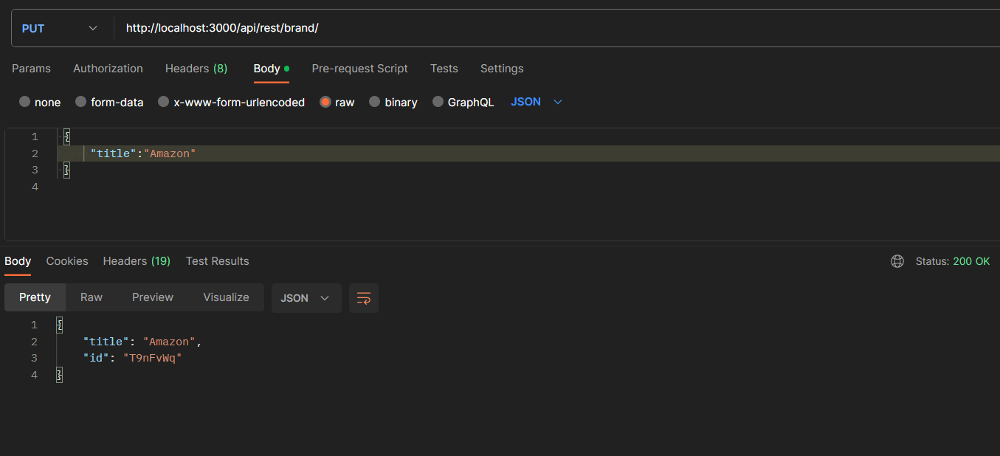
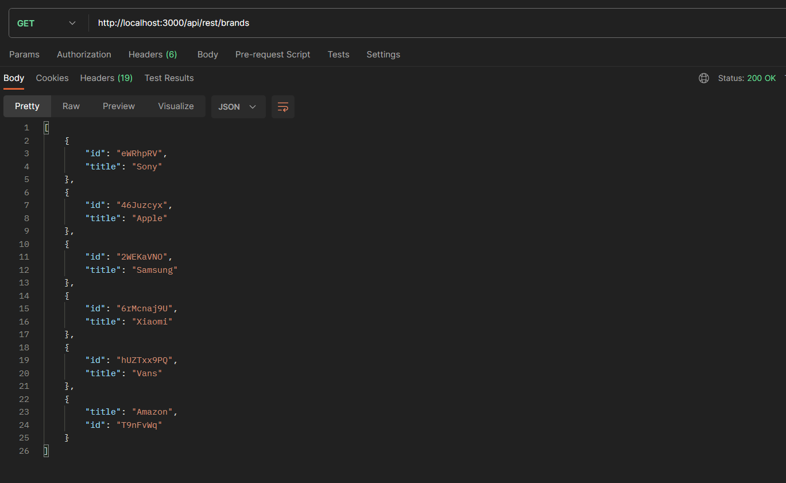
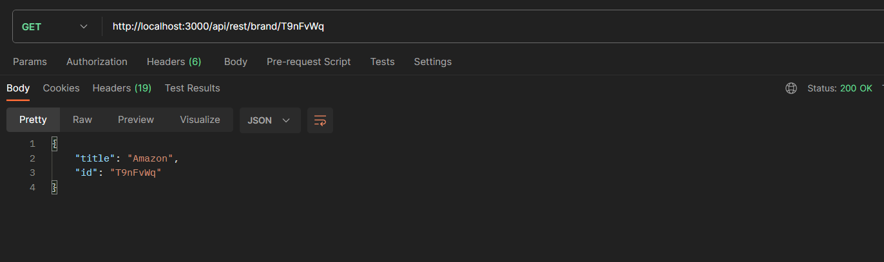
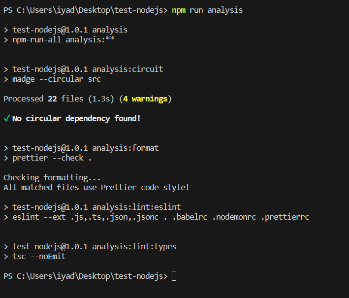

# Conception du module Requester

La première tâche à effectuer était de concevoir le module Requester:

Au sein du fichier src/repository/repository.ts, on retrouve une fonction create, une fonction findAll, ainsi qu'une fonction findById.

J'ai donc créé un fichier *requester.ts* au sein du quel j'ai implémenté ces fonctions.

Je me suis aidé de Postman afin de tester les différentes requêtes. Voici les 3 captures d'écran correspondant aux différentes fonctions  :

## Correction des erreurs via le script d'analyse du code

La deuxième tâche à effectuer était de corriger les erreurs détectables par les scripts d'analyse statique du code:

Afin de corriger les erreurs via le script d'analyse du code, j'ai utilisé la commande : *npm run analysis*

Au cours des différents lancements de cette commande, elle m'a retourné les erreurs suivantes: 

* Circular Dependency 
* Import Order 
* Code Style Issues
* format error: unexpected "\r".

J'ai résolu les erreurs circular dependency et import order en modifiant le code.

J'ai résolu code style issues en utilisant la commande:  *npx prettier --write .*

Et j'ai enfin résolu l'erreur de format en passant les fichier concerné du format CRLF au format LF.

Après etre venu a bout de toutes ces erreurs, voici une capture d'écran de la commande: *npm run analysis*

